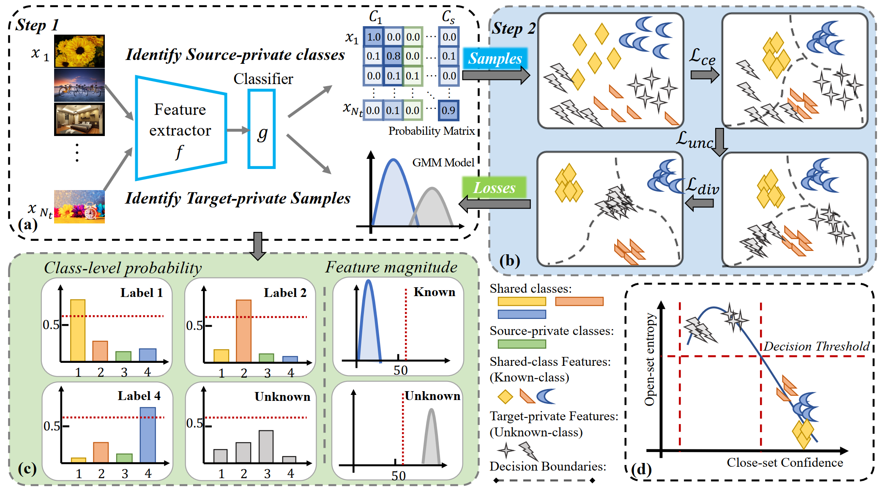

# Enhancing Source-free Universal Domain Adaptation via Private Signal Discovery

## Introduction
Source-Free Universal Domain Adaptation (UniDA) aims to transfer knowledge from a source domain to a target domain without access to the source data nor prior knowledge about the category shift between domains.
In this paper, we propose IBA (Identify Before Adaptation), a novel source-free domain adaptation framework that explicitly identifies both source-private and target-private signals before model adaptation. IBA employs a two-stage process: first, it uses prior class probability distributions to differentiate between source- and target-private information; second, it introduces two specialized loss functions that encourage the separation of known and unknown samples within the target domain.

## Framework

## Prerequisites
- python3, pytorch, numpy, scipy, sklearn, tqdm, etc.
- We have presented the our conda environment file in `./environment.yml`.

## Dataset
We conduct extensive experiments on three standard domain adaptation benchmarks:
- Office
- OfficeHome
- VisDA

Please manually download these datasets from the official websites and unzip them to the `./data` folder. We have included as supplementary the Office dataset (only Amazon and Webcam available due to submission size constraints).

The data structure should look like:

```
./data
├── Office
│   ├── Amazon
│   │   └── ...
│   └── Webcam
│       └── ...
├── OfficeHome
│   └── ...
└── VisDA
   └── ...
```
## Step
1. Please prepare the environment first.
2. Please download the datasets from the corresponding official websites, and then unzip them to the `./data` folder.
3. Preparing the source model.
4. Performing the target model adaptation.
## Training
```
# Source Model Preparing
bash ./scripts/train_source_OPDA.sh
#Target Model Adaptation
bash ./scripts/train_target_IBA_OPDA.sh
```
The code to run AaD, GLC, and LEAD baselines is also available. 

## Project stucture: 
```
├── data/                  # Dataset folder
├── figures/               # Framework and result visualizations
├── scripts/                # Training scripts
│   ├── train_source_OPDA.sh
│   ├── train_source_OSDA.sh
│   ├── train_source_PDA.sh
│   ├── train_target_IBA_OPDA.sh
│   ├── train_target_IBA_OSDA.sh
│   └── train_target_IBA_PDA.sh
├── environment.yml       # Conda environment file
└── README.md
```

## Acknowledgements 
The majority of this code has been adapted from the following papers:
```
@inproceedings{sanqing2024LEAD,
  title={LEAD: Learning Decomposition for Source-free Universal Domain Adaptation},
  author={Qu, Sanqing and Zou, Tianpei and He, Lianghua and Röhrbein, Florian and Knoll, Alois and Chen, Guang and Jiang, Changjun},
  booktitle={CVPR},
  year={2024},
}
@article{nejjar2024recall,
  title={Recall and Refine: A Simple but Effective Source-free Open-set Domain Adaptation Framework},
  author={Nejjar, Ismail and Dong, Hao and Fink, Olga},
  journal={arXiv preprint},
  year={2024}
}
```


## Contact
- Zhijingwang@std.uestc.edu.cn# IBA-main
